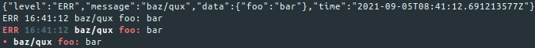

# log

Package log implements structured logging helpers.

Levels are supported with the following intended production semantics:

- **DBG:** debug
- **INF:** machine-actionable
- **WRN:** human-observable
- **ERR:** human-actionable

Handlers are used to format log entry output. The following functions return
loggers with preconfigured handlers. Optionally write your own by implementing
the `log.Handler` interface.

- [NewLogger](https://pkg.go.dev/github.com/pnelson/log#NewLogger)
- [NewTextLogger](https://pkg.go.dev/github.com/pnelson/log#NewTextLogger)
- [NewShellLogger](https://pkg.go.dev/github.com/pnelson/log#NewShellLogger)
- [NewMinimalShellLogger](https://pkg.go.dev/github.com/pnelson/log#NewMinimalShellLogger)
- [NewDiscardLogger](https://pkg.go.dev/github.com/pnelson/log#NewDiscardLogger)

## Usage

```go
package main

import (
	"os"

	"github.com/pnelson/log"
)

func main() {
	loggers := []*log.Logger{
		log.NewLogger(os.Stderr),
		log.NewTextLogger(os.Stderr),
		log.NewShellLogger(os.Stderr),
		log.NewMinimalShellLogger(os.Stderr),
		log.NewDiscardLogger(),
	}
	for _, l := range loggers {
		l.Log(log.ERR, log.M{"foo": "bar"}, "baz/%s", "qux")
	}
}
```


